# Day3 overall summary 

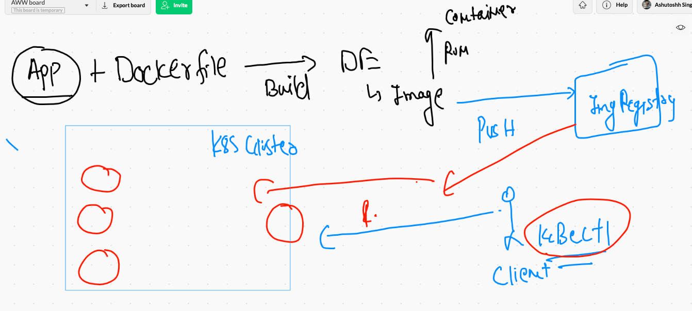

## checking connection 

```
❯ kubectl   get   nodes
NAME         STATUS   ROLES                  AGE   VERSION
masternode   Ready    control-plane,master   25h   v1.21.1
minion1      Ready    <none>                 25h   v1.21.1
minion2      Ready    <none>                 25h   v1.21.1
minion3      Ready    <none>                 25h   v1.21.1
```


## checking number of pods 

```
❯ kubectl  get  pods
NAME           READY   STATUS    RESTARTS   AGE
ajitpod-123    1/1     Running   1          16h
ashupod-123    1/1     Running   1          16h
asimpod-123    1/1     Running   1          16h
ganesh-123     1/1     Running   1          16h
narsing-123    1/1     Running   1          16h
priyapod-123   1/1     Running   1          16h
rahulpod-123   1/1     Running   1          16h
shobhit-pod    1/1     Running   1          16h
sudhi-pod1     1/1     Running   1          16h

```

## Deleting pods 

```
❯ kubectl  delete  po   ashupod-123
pod "ashupod-123" deleted
```

## namespace introduction. 

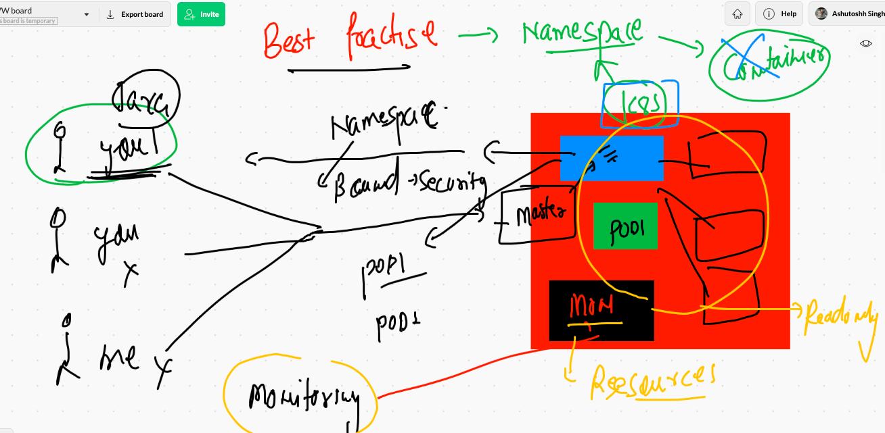

## list of namespaces

```
❯ kubectl   get  ns
NAME                   STATUS   AGE
default                Active   25h
delvex                 Active   101m
ingress-nginx          Active   25h
kube-node-lease        Active   25h
kube-public            Active   25h
kube-system            Active   25h
kubernetes-dashboard   Active   16h
new                    Active   130m
oracle                 Active   25h
```

###. default namespaces 

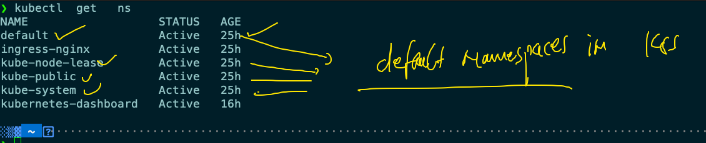

## checking kube-system namespace 

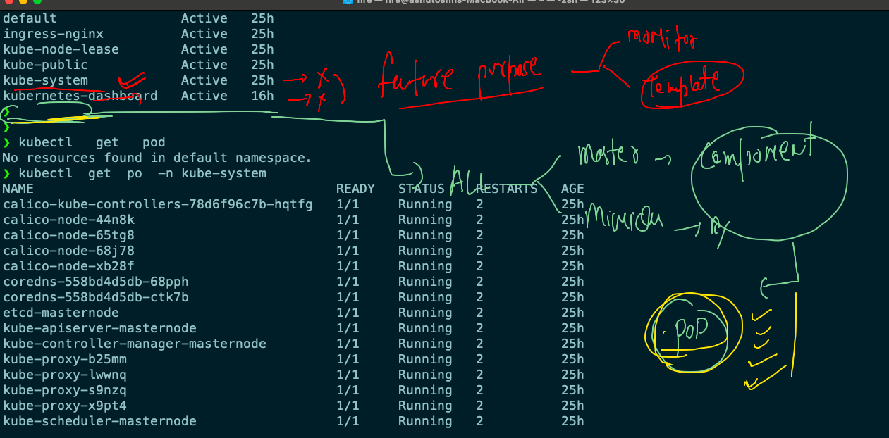

## creating namespace 

```
❯ kubectl  create   namespace   ashuproject1
namespace/ashuproject1 created
❯ kubectl  get  ns
NAME                   STATUS   AGE
ashuproject1           Active   5s
default                Active   25h

```

## chaning default namespace 

```
❯ kubectl   get   po
No resources found in default namespace.
❯ kubectl  config  set-context --current  --namespace=ashuproject1
Context "kubernetes-admin@kubernetes" modified.
❯ kubectl   get   po
No resources found in ashuproject1 namespace.

```

### deploy pod 

```
❯ kubectl  apply -f  ashupod1.yaml
pod/ashupod-123 created
❯ kubectl  get  po
NAME          READY   STATUS    RESTARTS   AGE
ashupod-123   1/1     Running   0          13s
❯ kubectl  get  po
NAME          READY   STATUS    RESTARTS   AGE
ashupod-123   1/1     Running   0          53s
❯ kubectl  get  po -o wide
NAME          READY   STATUS    RESTARTS   AGE   IP               NODE      NOMINATED NODE   READINESS GATES
ashupod-123   1/1     Running   0          62s   192.168.50.205   minion3   <none>           <none>


```

## checking current namespace 

```
❯ kubectl  get  po
NAME          READY   STATUS    RESTARTS   AGE
ashupod-123   1/1     Running   0          10m
❯ kubectl  config  get-contexts
CURRENT   NAME                          CLUSTER      AUTHINFO           NAMESPACE
*         kubernetes-admin@kubernetes   kubernetes   kubernetes-admin   ashuproject1


```


## auto-generating yaml for POD

```
10005  kubectl  run   ashupod-2   --image=dockerashu/httpd:25thmay2021v1  --port=80  --dry-run=client 
10006  kubectl  run   ashupod-2   --image=dockerashu/httpd:25thmay2021v1  --port=80  --dry-run=client  -o yaml 
10007  cd  Desktop/myapps/Pod
10008  ls
10009  kubectl  run   ashupod-2   --image=dockerashu/httpd:25thmay2021v1  --port=80  --dry-run=client  -o yaml  >abc.yml
10010  ls

```

# accessing pod app from k8s client machine 

```
❯ kubectl  port-forward   ashupod-2    1234:80
Forwarding from 127.0.0.1:1234 -> 80
Forwarding from [::1]:1234 -> 80
Handling connection for 1234
Handling connection for 1234

```


## access info 

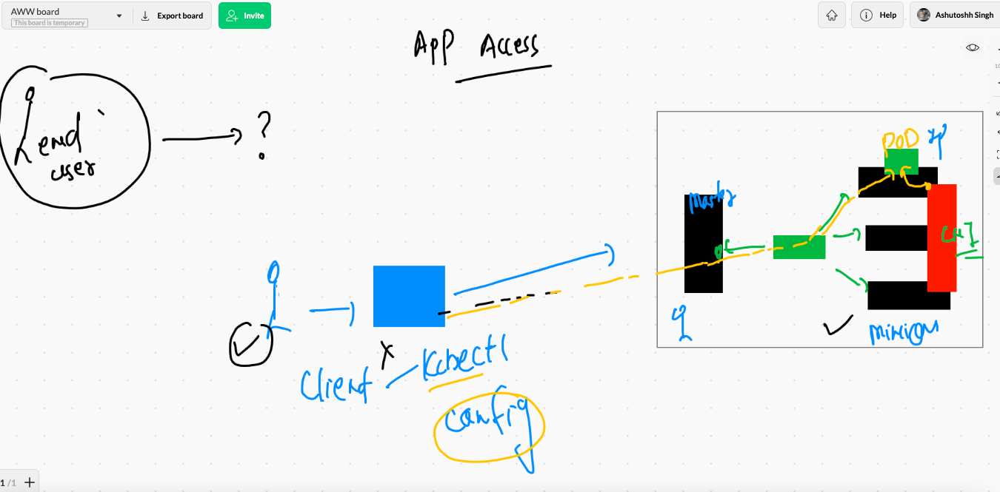

## Introduction to service in k8s 

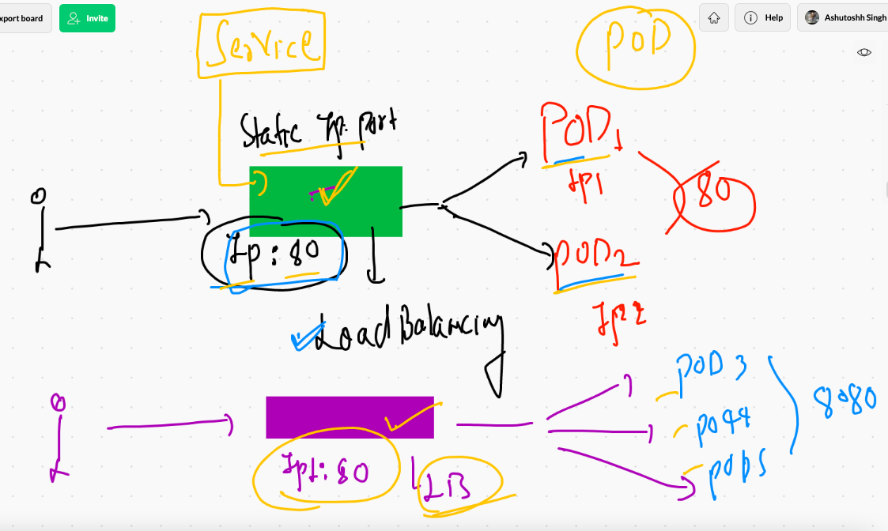

## k8s service connecting to POD 

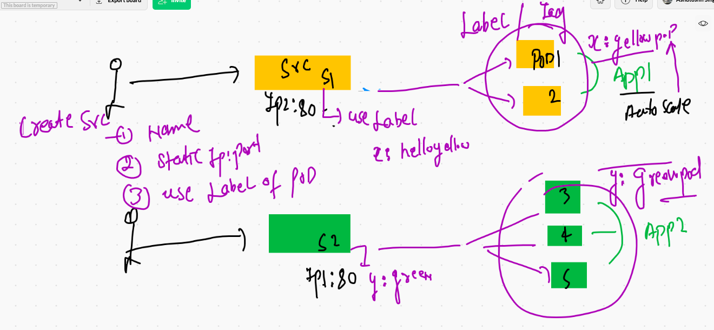

## type of service in k8s

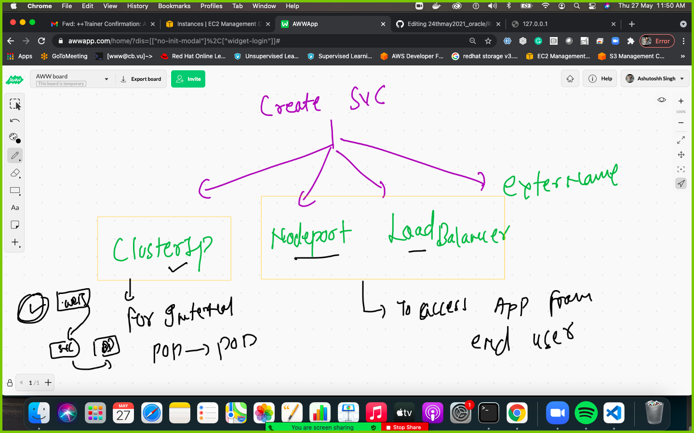

## Nodeport type service 

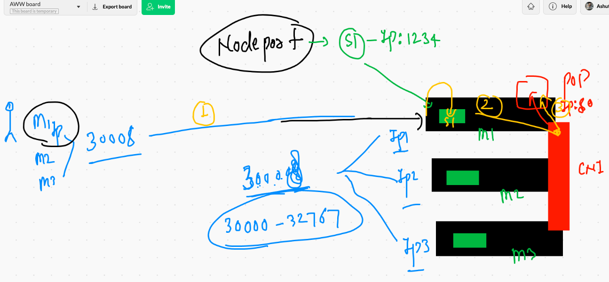

## checking and assigning label to a POD

```
❯ kubectl  get  po
NAME          READY   STATUS    RESTARTS   AGE
ashupod-123   1/1     Running   0          101m
ashupod-2     1/1     Running   0          82m
❯ kubectl  get  po --show-labels
NAME          READY   STATUS    RESTARTS   AGE    LABELS
ashupod-123   1/1     Running   0          101m   <none>
ashupod-2     1/1     Running   0          82m    run=ashupod-2
❯ ls
abc.yml       ashupod1.yaml newpod.yml
❯ kubectl  apply -f  ashupod1.yaml
pod/ashupod-123 configured
❯ kubectl  get  po --show-labels
NAME          READY   STATUS    RESTARTS   AGE    LABELS
ashupod-123   1/1     Running   0          102m   x=helloashu
ashupod-2     1/1     Running   0          83m    run=ashupod-2

```

## creating nodeport service 

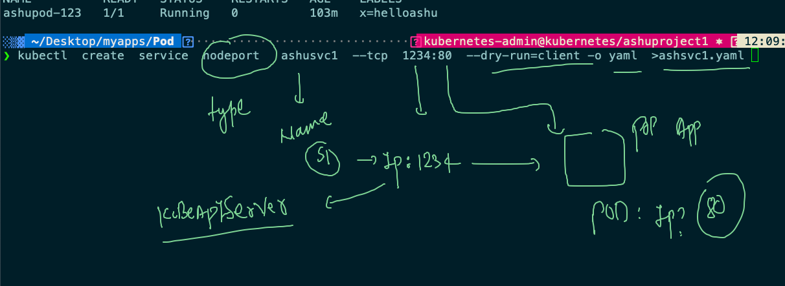


## understanding service YAML 

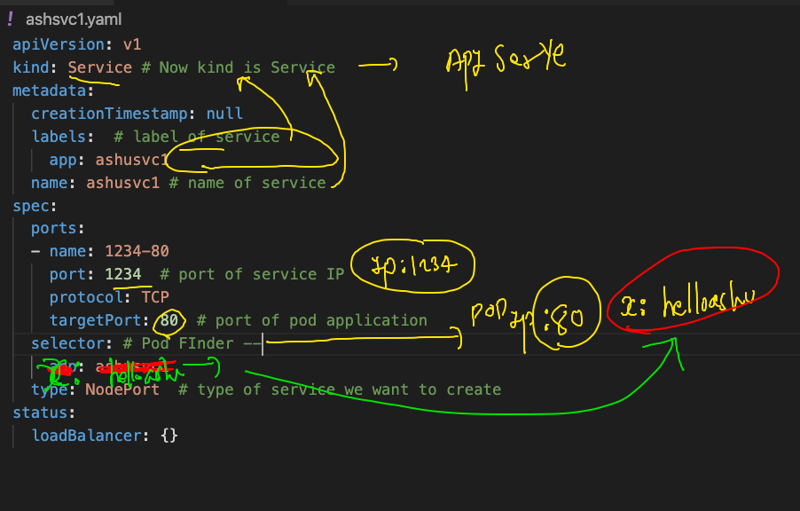

## svc got deployed 

```
❯ kubectl  apply   -f  ashsvc1.yaml
service/ashusvc1 created

```

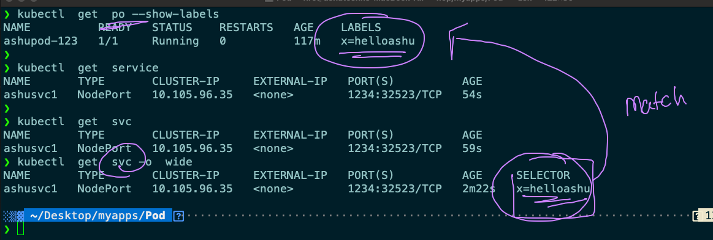


## help from kubectl 

```
062  kubectl  create   service   nodeport  --help
10063  history
10064  kubectl  run  --help
10065  history
10066  kubectl  run  --help
10067  history
10068  kubectl  explain  pod
10069  kubectl  explain  pod.spec 
10070  kubectl  explain  pod.spec.containers 

```

## Installing k8s cluster using Minikube --

### Download minikube for Your Laptop 

[minikube](https://storage.googleapis.com/minikube/releases/)

## starting minikube based k8s cluster 

### 

```
minikube  start  --driver=docker  

```

### Note: here --driver can have ,docker , vmware , virtualbox , podman and other optiosn 

### checkign status 

```
❯ minikube  status
minikube
type: Control Plane
host: Running
kubelet: Running
apiserver: Running
kubeconfig: Configured


```

### checking contexts 

```
❯ kubectl  config  get-contexts
CURRENT   NAME                          CLUSTER      AUTHINFO           NAMESPACE
          kubernetes-admin@kubernetes   kubernetes   kubernetes-admin   ashuproject1
*         minikube                      minikube     minikube           default
❯ kubectl  get  nodes
NAME       STATUS   ROLES                  AGE   VERSION
minikube   Ready    control-plane,master   22m   v1.20.2


```

### switching contexts 

```
❯ kubectl  config use-context  kubernetes-admin@kubernetes
Switched to context "kubernetes-admin@kubernetes".
❯ kubectl  get  nodes
NAME         STATUS   ROLES                  AGE   VERSION
masternode   Ready    control-plane,master   30h   v1.21.1
minion1      Ready    <none>                 30h   v1.21.1
minion2      Ready    <none>                 30h   v1.21.1
minion3      Ready    <none>                 30h   v1.21.1
❯ kubectl  config  get-contexts
CURRENT   NAME                          CLUSTER      AUTHINFO           NAMESPACE
*         kubernetes-admin@kubernetes   kubernetes   kubernetes-admin   ashuproject1
          minikube                      minikube     minikube           default
❯ kubectl  config use-context  minikube
Switched to context "minikube".
❯ kubectl  get  nodes
NAME       STATUS   ROLES                  AGE   VERSION
minikube   Ready    control-plane,master   24m   v1.20.2
```


### Minikube cluster command 

```
10109  minikube node  add
10110  minikube  status 
10111  kubectl  config use-context  minikube 
10112  kubectl  get  no
10113  minikube node  delete 
10114  minikube node  delete  minikube-m02 

```

## K8s dashboard deployment 

### understanding users 

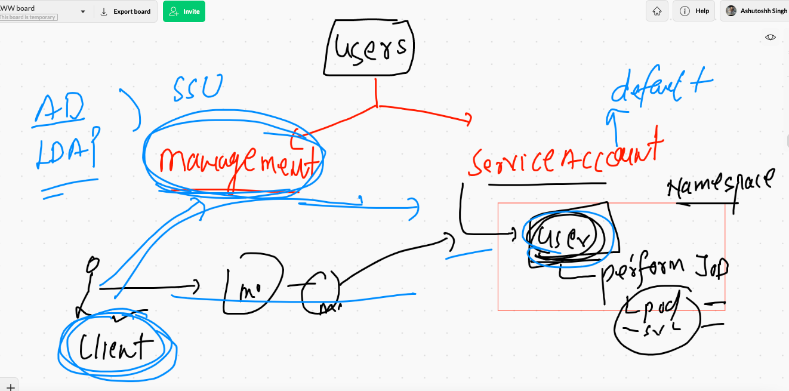


# Replicationg controller 

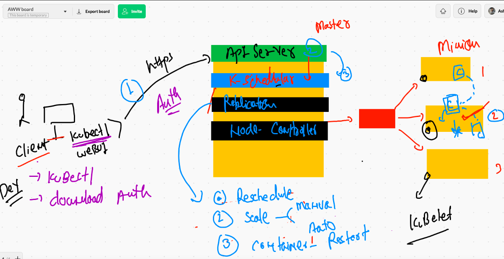

## Deploying RC 

```
❯ kubectl  get  rc
NAME       DESIRED   CURRENT   READY   AGE
ashu-rc1   1         1         1       12m
❯ kubectl  get  po
NAME             READY   STATUS    RESTARTS   AGE
ashu-rc1-j8569   1/1     Running   0          9m21s
❯ kubectl  get  svc
No resources found in ashuproject1 namespace.
❯ kubectl  apply -f  ashurc1.yaml
Warning: resource replicationcontrollers/ashu-rc1 is missing the kubectl.kubernetes.io/last-applied-configuration annotation which is required by kubectl apply. kubectl apply should only be used on resources created declaratively by either kubectl create --save-config or kubectl apply. The missing annotation will be patched automatically.
replicationcontroller/ashu-rc1 configured
service/ashusvc099 created
❯ kubectl  get  po
NAME             READY   STATUS    RESTARTS   AGE
ashu-rc1-j8569   1/1     Running   0          9m37s
❯ kubectl  get  svc
NAME         TYPE       CLUSTER-IP       EXTERNAL-IP   PORT(S)          AGE
ashusvc099   NodePort   10.107.236.205   <none>        1223:32305/TCP   10s

```

## scaling pod using RC 

```
❯ kubectl  scale  rc   ashu-rc1  --replicas=5
replicationcontroller/ashu-rc1 scaled
❯ kubectl   get  rc
NAME       DESIRED   CURRENT   READY   AGE
ashu-rc1   5         5         5       19m
❯ kubectl   get  po
NAME             READY   STATUS    RESTARTS   AGE
ashu-rc1-46nk9   1/1     Running   0          10s
ashu-rc1-clpwn   1/1     Running   0          10s
ashu-rc1-j8569   1/1     Running   0          15m
ashu-rc1-mrzhx   1/1     Running   0          10s
ashu-rc1-vlpsc   1/1     Running   0          10s

```

##  more commands to RC 

```
10168  kubectl  scale  rc   ashu-rc1  --replicas=5
10169  kubectl   get  rc 
10170  kubectl   get  po
10171  history
10172  kubectl   get  po
10173  kubectl  scale  rc   ashu-rc1  --replicas=2
10174  kubectl   get  po
❯ kubectl  get  rc
NAME       DESIRED   CURRENT   READY   AGE
ashu-rc1   2         2         2       24m
❯ 
❯ 
❯ kubectl  expose  rc   ashu-rc1  --type NodePort  --port 1234 --target-port 80 --name ashusvc88
service/ashusvc88 exposed
❯ kubectl  get  svc
NAME         TYPE       CLUSTER-IP       EXTERNAL-IP   PORT(S)          AGE
ashusvc099   NodePort   10.107.236.205   <none>        1223:32305/TCP   11m
ashusvc88    NodePort   10.104.253.102   <none>        1234:32476/TCP   7s

```

## k8s POD -RC -RS -Deployment journey 


## Deployment understanding 


## Deployment in reality 


