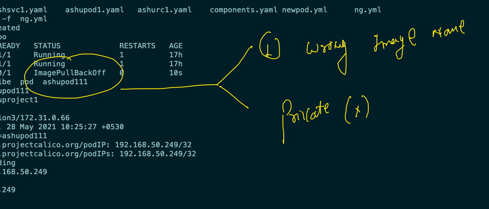
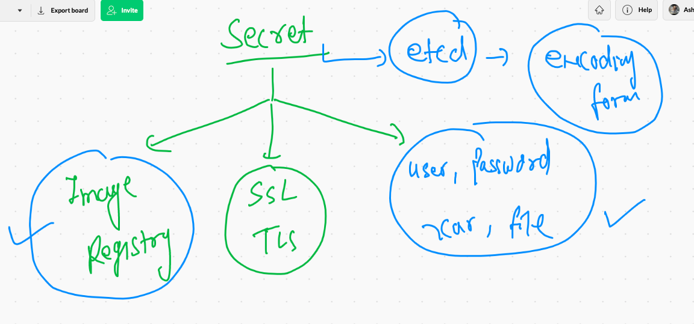

# Just overview 


## Deployment ACR image to k8s as POD 

### pushing image to ACR 

```
 docker  tag   nginx:28thmay2021v1    oracleindia.azurecr.io/nginx:28thmay2021v1 
 docker login  oracleindia.azurecr.io
 docker  push  oracleindia.azurecr.io/nginx:28thmay2021v1 
 docker logout oracleindia.azurecr.io
 ```

### deploy pod 



## secret understanding 



## ACR image deployment in k8s

### creating secret 

```
❯ kubectl  create  secret    docker-registry   ashusec  --docker-server=oraclein.azurecr.io  --docker-username=oraclein      --docker-password=pbJxt=N0nVD1FIqpDc -n  ashuproject1
secret/ashusec created
❯ kubectl  get  secret
NAME                  TYPE                                  DATA   AGE
ashusec               kubernetes.io/dockerconfigjson        1      39s
default-token-gb5gm   kubernetes.io/service-account-token   3      24h


```


### node dedploying 

```
❯ kubectl  get  po
NAME             READY   STATUS             RESTARTS   AGE
ashu-rc1-46nk9   1/1     Running            1          17h
ashu-rc1-j8569   1/1     Running            1          18h
ashupod111       0/1     ImagePullBackOff   0          14m
❯ kubectl  replace  -f  ng.yml  --force
pod "ashupod111" deleted
pod/ashupod111 replaced
❯ kubectl  get  po
NAME             READY   STATUS    RESTARTS   AGE
ashu-rc1-46nk9   1/1     Running   1          17h
ashu-rc1-j8569   1/1     Running   1          18h
ashupod111       1/1     Running   0          4s

```

### creating service 

```
kubectl  expose pod  ashupod111  --type NodePort --port 1234 --target-port 80  --name ashuss11 

```

### cleaning up 

```
❯ kubectl  delete  all --all
pod "ashu-rc1-46nk9" deleted
pod "ashu-rc1-j8569" deleted
pod "ashupod111" deleted
replicationcontroller "ashu-rc1" deleted
service "ashuss11" deleted
service "ashusvc099" deleted
service "ashusvc88" deleted

```


