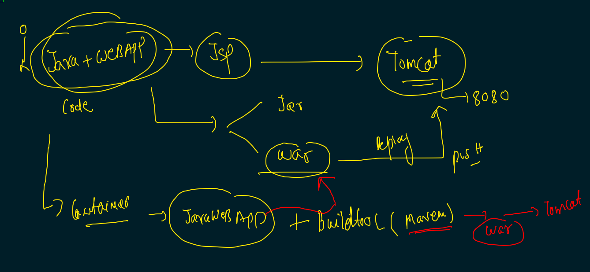

# Just overview 


## Deployment ACR image to k8s as POD 

### pushing image to ACR 

```
 docker  tag   nginx:28thmay2021v1    oracleindia.azurecr.io/nginx:28thmay2021v1 
 docker login  oracleindia.azurecr.io
 docker  push  oracleindia.azurecr.io/nginx:28thmay2021v1 
 docker logout oracleindia.azurecr.io
 ```

### deploy pod 


## secret understanding 


## ACR image deployment in k8s

### creating secret 

```
❯ kubectl  create  secret    docker-registry   ashusec  --docker-server=oraclein.azurecr.io  --docker-username=oraclein      --docker-password=pbJxt=N0nVD1FIqpDc -n  ashuproject1
secret/ashusec created
❯ kubectl  get  secret
NAME                  TYPE                                  DATA   AGE
ashusec               kubernetes.io/dockerconfigjson        1      39s
default-token-gb5gm   kubernetes.io/service-account-token   3      24h


```


### node dedploying 

```
❯ kubectl  get  po
NAME             READY   STATUS             RESTARTS   AGE
ashu-rc1-46nk9   1/1     Running            1          17h
ashu-rc1-j8569   1/1     Running            1          18h
ashupod111       0/1     ImagePullBackOff   0          14m
❯ kubectl  replace  -f  ng.yml  --force
pod "ashupod111" deleted
pod/ashupod111 replaced
❯ kubectl  get  po
NAME             READY   STATUS    RESTARTS   AGE
ashu-rc1-46nk9   1/1     Running   1          17h
ashu-rc1-j8569   1/1     Running   1          18h
ashupod111       1/1     Running   0          4s

```

### creating service 

```
kubectl  expose pod  ashupod111  --type NodePort --port 1234 --target-port 80  --name ashuss11 

```

### cleaning up 

```
❯ kubectl  delete  all --all
pod "ashu-rc1-46nk9" deleted
pod "ashu-rc1-j8569" deleted
pod "ashupod111" deleted
replicationcontroller "ashu-rc1" deleted
service "ashuss11" deleted
service "ashusvc099" deleted
service "ashusvc88" deleted

```

## Deployment 


### creating 

```
 kubectl  create  deployment   ashudep111  --image=oracleindia.azurecr.io/nginx:28thmay2021v1  --dry-run=client -o yaml              >deploy1.yml
 
 
```

### creating LB service 

```
 kubectl   create  service  loadbalancer  ashusv443  --tcp  1234:80  --dry-run=client  -o yaml 
 
```
### deploying 

```

❯ kubectl  apply -f  deploy1.yml
deployment.apps/ashudep111 created
service/ashusv443 created
❯ kubectl  get deploy
NAME         READY   UP-TO-DATE   AVAILABLE   AGE
ashudep111   0/1     1            0           8s
❯ kubectl  get   rs
NAME                    DESIRED   CURRENT   READY   AGE
ashudep111-576f7d58bb   1         1         1       12s
❯ kubectl  get   pod
NAME                          READY   STATUS    RESTARTS   AGE
ashudep111-576f7d58bb-hvgvj   1/1     Running   0          16s
❯ kubectl  get   svc
NAME        TYPE           CLUSTER-IP      EXTERNAL-IP   PORT(S)          AGE
ashusv443   LoadBalancer   10.103.135.81   <pending>     1234:30277/TCP   20s

```

### scaling 

```
❯ kubectl  get  deploy
NAME         READY   UP-TO-DATE   AVAILABLE   AGE
ashudep111   1/1     1            1           7m51s
❯ kubectl  scale  deploy ashudep111  --replicas=5
deployment.apps/ashudep111 scaled
❯ kubectl  get  deploy
NAME         READY   UP-TO-DATE   AVAILABLE   AGE
ashudep111   1/5     5            1           8m6s
❯ kubectl  get  deploy
NAME         READY   UP-TO-DATE   AVAILABLE   AGE
ashudep111   5/5     5            5           8m9s

```

## java web deployment model 



### creating java webapp deployment 

```
kubectl  create  deployment  ashujavaweb  --image=dockerashu/javawebapp:28thmay2021_v1  --dry-run=client -o yaml  >jsp.yml

```
### creating nodeport service 

```
kubectl  create  service  nodeport  ssvc1  --tcp  1234:8080 --namespace ashuproject1  --dry-run=client -o yaml
apiVersion: v1
kind: Service
metadata:
  creationTimestamp: null
  labels:
    app: ssvc1
  name: ssvc1
  namespace: ashuproject1
spec:
  ports:
  - name: 1234-8080
    port: 1234
    protocol: TCP
    targetPort: 8080
  selector:
    app: ssvc1
  type: NodePort
status:
  loadBalancer: {}

```

## checking deployment and svc


```
❯ kubectl  get deploy,rs,pod,svc
NAME                          READY   UP-TO-DATE   AVAILABLE   AGE
deployment.apps/ashujavaweb   1/1     1            1           11m

NAME                                    DESIRED   CURRENT   READY   AGE
replicaset.apps/ashujavaweb-744b6d758   1         1         1       11m

NAME                              READY   STATUS    RESTARTS   AGE
pod/ashujavaweb-744b6d758-jpfw6   1/1     Running   0          11m

NAME            TYPE       CLUSTER-IP      EXTERNAL-IP   PORT(S)          AGE
service/ssvc1   NodePort   10.108.229.94   <none>        1234:32567/TCP   11m


```


### checking describe output of deployment 

```
❯ kubectl  describe  deployment  ashujavaweb
Name:                   ashujavaweb
Namespace:              ashuproject1
CreationTimestamp:      Fri, 28 May 2021 12:36:25 +0530
Labels:                 app=ashujavaweb
Annotations:            deployment.kubernetes.io/revision: 1
Selector:               app=ashujavaweb
Replicas:               1 desired | 1 updated | 1 total | 1 available | 0 unavailable
StrategyType:           RollingUpdate
MinReadySeconds:        0
RollingUpdateStrategy:  25% max unavailable, 25% max surge
Pod Template:
  Labels:  app=ashujavaweb
  Containers:
   javawebapp:
    Image:        dockerashu/javawebapp:28thmay2021_v1
    Port:         8080/TCP
    Host Port:    0/TCP
    Environment:  <none>
    Mounts:       <none>
  Volumes:        <none>
Conditions:
  Type           Status  Reason
  
```


## updating app 

```
kubectl  set  image  deployment  ashujavaweb    javawebapp=dockerashu/javawebapp:28thmay2021_v2
deployment.apps/ashujavaweb image updated

```

### revision history 

```
❯ kubectl  rollout  history deployment  ashujavaweb
deployment.apps/ashujavaweb 
REVISION  CHANGE-CAUSE
1         <none>
2         <none>

```

### rolling out 

```
❯ kubectl  rollout  history deployment  ashujavaweb
deployment.apps/ashujavaweb 
REVISION  CHANGE-CAUSE
1         <none>
2         <none>

❯ kubectl  rollout  undo  deployment  ashujavaweb
deployment.apps/ashujavaweb rolled back
❯ kubectl  rollout  status  deployment  ashujavaweb
deployment "ashujavaweb" successfully rolled out

```

## RBAC. 

## creating a restricted access in K8s 

### steps

```

 kubectl   create   namespace   ashu-friend 
10368  kubectl  get  ns
10369  kubectl get  sa   -n   ashu-friend 
10370  kubectl  creata  sa  jack    -n   ashu-friend 
10371  kubectl  create  sa  jack    -n   ashu-friend 
10372  kubectl get  sa   -n   ashu-friend 
10373  kubectl get  secret  -n   ashu-friend 
10374  kubectl describe   secret  default-token-5w5cm   -n   ashu-friend 


