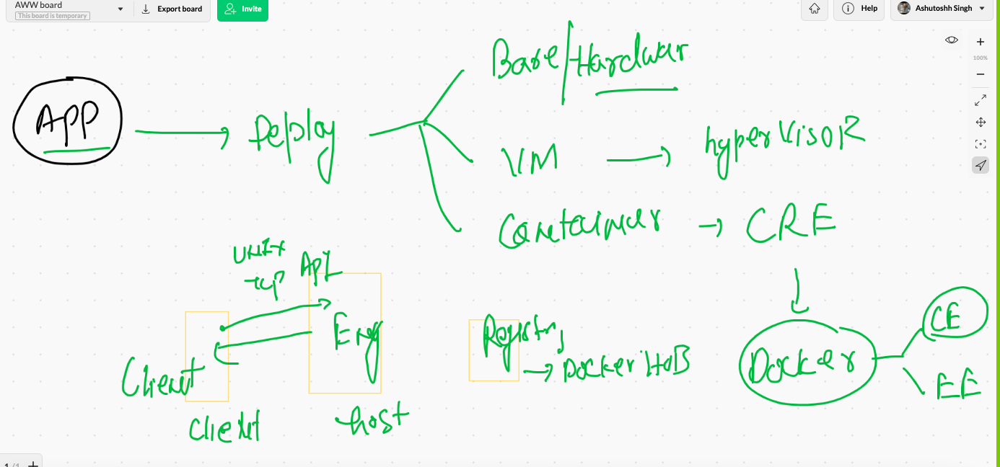

# Day1 recall

## snap 



## removing all containers 

```

 docker rm  $(docker ps -aq) 
 
```

## Webapplication containerization 

### webservers 


## apache httpd webserver


## Dockerfile for apache httpd 


## Building images 

```
❯ cd beginner-html-site-styled
❯ ls
CODE_OF_CONDUCT.md LICENSE            images             styles
Dockerfile         README.md          index.html
❯ docker  build  -t  httpd:25thmay2021v1  .
Sending build context to Docker daemon  63.49kB
Step 1/6 : FROM oraclelinux:8.3
 ---> 816d99f0bbe8
Step 2/6 : MAINTAINER ashutoshh@linux.com
 ---> Using cache
 ---> af0ac62760ea
Step 3/6 : RUN dnf install httpd -y
 ---> Running in ac7dd4a1aefa


```

### images 

```
❯ docker  images
REPOSITORY    TAG             IMAGE ID       CREATED              SIZE
httpd         shah1           d00966056023   About a minute ago   352MB
httpd         25thmay2021v1   8b0e7be25674   About a minute ago   352MB
httpdasim     training        a3411d2f05e9   2 minutes ago        352MB


```


## image build history 

```
❯ docker  history  8b0e7be25674
IMAGE          CREATED         CREATED BY                                      SIZE      COMMENT
8b0e7be25674   4 minutes ago   /bin/sh -c #(nop)  CMD ["httpd" "-DFOREGROUN…   0B        
a107416d461f   4 minutes ago   /bin/sh -c #(nop) COPY dir:a10de42d8e22bf749…   57.1kB    
880e35d49aaf   4 minutes ago   /bin/sh -c #(nop) WORKDIR /var/www/html/        0B        
e389d9de2a06   4 minutes ago   /bin/sh -c dnf install httpd -y                 128MB     
af0ac62760ea   18 hours ago    /bin/sh -c #(nop)  MAINTAINER ashutoshh@linu…   0B        
816d99f0bbe8   5 weeks ago     /bin/sh -c #(nop)  CMD ["/bin/bash"]            0B        
<missing>      5 weeks ago     /bin/sh -c #(nop) ADD file:8d6d5e7607cbe7af8…   224MB     

```

### docker run 

```
❯ docker  run -itd --name ashuwebc1  -p  1234:80   httpd:25thmay2021v1
45cfba4274a1752fc9a77a6a2de847ff6ebc6d5fa1cfe458d12c724eae9f9d13

```

### Docker images registry -- Docker hub 


## docker image name reality 


## tagging docker image as your docker user ID before pusing 

```
docker  tag     httpd:25thmay2021v1    dockerashu/httpd:25thmay2021v1
```

### pushing history 

```
10059  docker  tag     httpd:25thmay2021v1    dockerashu/httpd:25thmay2021v1  
10060  docker  images
10061  history
10062  docker  images
❯ docker  login  -u dockerashu
Password: 
Login Succeeded
❯ docker  push  dockerashu/httpd:25thmay2021v1
The push refers to repository [docker.io/dockerashu/httpd]
729ef4f54cc3: Pushed 
9dc80c6bdbab: Pushed 
02a3a073ed48: Mounted from library/oraclelinux 
25thmay2021v1: digest: sha256:a44cfd3acea1810ce3e1a397aceaf2af0600fde185930fa822e31434e5960bf7 size: 950
❯ docker  logout
Removing login credentials for https://index.docker.io/v1/


```

# Docker networking 


## Docker0 bridge on Host side


## inspecting bridge

```
❯ docker  network  ls
NETWORK ID     NAME      DRIVER    SCOPE
11960b38a237   bridge    bridge    local
6c5eda50cb17   host      host      local
30e752f4b59b   none      null      local
❯ docker  network  inspect   11960b38a237
[
    {
        "Name": "bridge",
        "Id": "11960b38a237bdc82bf82fde7cd3ca882f34ba9be6b65514536fcfca4a1cc36a",
        "Created": "2021-05-25T04:14:42.241773547Z",
        "Scope": "local",
        "Driver": "bridge",
        "EnableIPv6": false,
        "IPAM": {
            "Driver": "default",
            "Options": null,
            "Config": [
                {
                    "Subnet": "172.17.0.0/16",
                    "Gateway": "172.17.0.1"
                    
 ```
 
 
 ### checking ip of a running container 
 
 ```
 ❯ docker   inspect   ashuc1
[
    {
        "Id": "46b2336b202b0c214de6f9cdc7d01c779d7668338617bfc8f701e1dbebad9574",
        "Created": "2021-05-25T06:44:28.427077541Z",
        "Path": "ping",
        "Args": [
            "fb.com"
        ],
        "State": {
            "Status": "running",
            "Running": true,
            "Paused": false,
            "Restarting": false,
            "OOMKilled": false,


--


"Networks": {
                "bridge": {
                    "IPAMConfig": null,
                    "Links": null,
                    "Aliases": null,
                    "NetworkID": "11960b38a237bdc82bf82fde7cd3ca882f34ba9be6b65514536fcfca4a1cc36a",
                    "EndpointID": "9d2209297b0a49d9e6d589727d8bd6565577ecc8591caef0b0a262f1978a9e2c",
                    "Gateway": "172.17.0.1",
                    "IPAddress": "172.17.0.2",
                    "IPPrefixLen": 16,
                    "IPv6Gateway": "",
                    "GlobalIPv6Address": "",
                    "GlobalIPv6PrefixLen": 0,
                    "MacAddress": "02:42:ac:11:00:02",
                    "DriverOpts": null
                }
            }
        }
    }
]


```

### checking container ip from inside container 

```
❯ docker  exec -it   ashuc1  sh
/ # ifconfig 
eth0      Link encap:Ethernet  HWaddr 02:42:AC:11:00:02  
          inet addr:172.17.0.2  Bcast:172.17.255.255  Mask:255.255.0.0
          UP BROADCAST RUNNING MULTICAST  MTU:1500  Metric:1
          RX packets:1155 errors:0 dropped:0 overruns:0 frame:0
          TX packets:1129 errors:0 dropped:0 overruns:0 carrier:0
          collisions:0 txqueuelen:0 
          RX bytes:108406 (105.8 KiB)  TX bytes:106810 (104.3 KiB)

lo        Link encap:Local Loopback  
          inet addr:127.0.0.1  Mask:255.0.0.0
          UP LOOPBACK RUNNING  MTU:65536  Metric:1
          RX packets:0 errors:0 dropped:0 overruns:0 frame:0
          TX packets:0 errors:0 dropped:0 overruns:0 carrier:0
          collisions:0 txqueuelen:1000 
          RX bytes:0 (0.0 B)  TX bytes:0 (0.0 B)

/ # ping 172.17.0.3
PING 172.17.0.3 (172.17.0.3): 56 data bytes
64 bytes from 172.17.0.3: seq=0 ttl=255 time=0.178 ms
64 bytes from 172.17.0.3: seq=1 ttl=255 time=0.119 ms
64 bytes from 172.17.0.3: seq=2 ttl=255 time=0.092 ms
^C
--- 172.17.0.3 ping statistics ---
3 packets transmitted, 3 packets received, 0% packet loss
round-trip min/avg/max = 0.092/0.129/0.178 ms
/ # exit

```

## NAT in docker host


### creating custom networking bridge 

```
❯ docker  network   create   ashubr1   --subnet  192.168.100.0/24
c031e4d492ea3630ee54c67943a0c3047c831581da60ea8f5caef4d0180d274e
❯ docker  network   ls
NETWORK ID     NAME      DRIVER    SCOPE
c031e4d492ea   ashubr1   bridge    local
11960b38a237   bridge    bridge    local
6c5eda50cb17   host      host      local
30e752f4b59b   none      null      local
❯ docker  network   inspect  ashubr1
[
    {
        "Name": "ashubr1",
        "Id": "c031e4d492ea3630ee54c67943a0c3047c831581da60ea8f5caef4d0180d274e",
        "Created": "2021-05-25T07:25:01.846420051Z",
        "Scope": "local",
        "Driver": "bridge",
        "EnableIPv6": false,

```

### creating bridge for containers


### launching container in custom bridge

```
❯ docker  run  -itd --name  ashuc3  --network ashubr1   alpine ping fb.com
b1df002a1b72dace21c5e6f8f3631855bcd7a2ae105f8d2182048a2cbc97ed3e
❯ docker  run  -itd --name  ashuc4  --network ashubr1 --ip 192.168.100.20  alpine ping fb.com
567b8aa2d21d198d683b01dc243c63b899c7e6c06a9e87602645e1a2e0bd80ea
❯ docker  network inspect  ashubr1
[
    {
        "Name": "ashubr1",
        "Id": "c031e4d492ea3630ee54c67943a0c3047c831581da60ea8f5caef4d0180d274e",
        "Created": "2021-05-25T07:25:01.846420051Z",
        "Scope": "local",
        "Driver": "bridge",
        "EnableIPv6": false,
        "IPAM": {
            "Driver": "default",
            "Options": {},
            "Config": [
                {
                    "Subnet": "192.168.100.0/24"
                }
            ]
        },
        "Internal": false,
        "Attachable": false,
        "Ingress": false,
        "ConfigFrom": {
            "Network": ""
        },
        "ConfigOnly": false,
        "Containers": {
            "567b8aa2d21d198d683b01dc243c63b899c7e6c06a9e87602645e1a2e0bd80ea": {
                "Name": "ashuc4",
                "EndpointID": "4ccaacded2282d625e1c3b2970cb792916536fd5c294b6aad38386f680cc74f5",
                "MacAddress": "02:42:c0:a8:64:14",
                "IPv4Address": "192.168.100.20/24",
                "IPv6Address": ""
            },
            "b1df002a1b72dace21c5e6f8f3631855bcd7a2ae105f8d2182048a2cbc97ed3e": {
                "Name": "ashuc3",
                "EndpointID": "22ca8acdaa8f8f8865db31bf7124c1ba12d601654d13f7fe8fa83fcd952fcca0",
                "MacAddress": "02:42:c0:a8:64:02",
                "IPv4Address": "192.168.100.2/24",
                "IPv6Address": ""
            }

```

### connecting a bridge to a container 

```
❯ docker  network connect  bridge  ashuc4
❯ docker  exec -it ashuc4 sh
/ # ifconfig 
eth0      Link encap:Ethernet  HWaddr 02:42:C0:A8:64:14  
          inet addr:192.168.100.20  Bcast:192.168.100.255  Mask:255.255.255.0
          UP BROADCAST RUNNING MULTICAST  MTU:1500  Metric:1
          RX packets:581 errors:0 dropped:0 overruns:0 frame:0
          TX packets:569 errors:0 dropped:0 overruns:0 carrier:0
          collisions:0 txqueuelen:0 
          RX bytes:55166 (53.8 KiB)  TX bytes:54186 (52.9 KiB)

eth1      Link encap:Ethernet  HWaddr 02:42:AC:11:00:11  
          inet addr:172.17.0.17  Bcast:172.17.255.255  Mask:255.255.0.0
          UP BROADCAST RUNNING MULTICAST  MTU:1500  Metric:1
          RX packets:8 errors:0 dropped:0 overruns:0 frame:0
          TX packets:0 errors:0 dropped:0 overruns:0 carrier:0
          collisions:0 txqueuelen:0 
          RX bytes:656 (656.0 B)  TX bytes:0 (0.0 B)
          
```


### connecting and disconnecting container to a bridge 

```
10113  docker  network connect  bridge  ashuc4 
10114  docker network ls
10115  docker  exec -it ashuc4 sh 
❯ docker  network disconnect  bridge  ashuc4


```

### Docker network bridge drivers 


### remove all network bridge 

```
❯ docker  network  prune
WARNING! This will remove all custom networks not used by at least one container.
Are you sure you want to continue? [y/N] y
Deleted Networks:
ganesh1
ashubr2
rahul1
shahbr1
sudhinw
ajitbr1
asimbridge
ashubr1
sreenathbr1
sivanetwork
govind5

❯ docker  network  ls
NETWORK ID     NAME      DRIVER    SCOPE
11960b38a237   bridge    bridge    local
6c5eda50cb17   host      host      local
30e752f4b59b   none      null      local

```


### Use of host bridge 


# webUI client for Docker engine 


##  Replacing ENV variable during container creation time 

```
  docker  build -t  test:envv1  . 
10135  docker  run -it --rm   test:envv1  bash 
10136  docker  run -it --rm  -e  x=500  test:envv1  bash 

```


