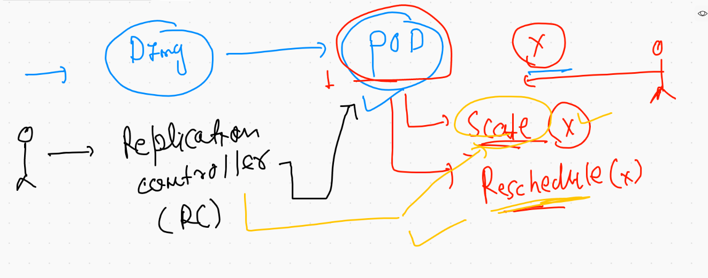

# Docker & containers overview 


## Remove docker engine with ssh as context 


### Demo of mac os with Linux DE


```

docker  context  create  secureaws   --docker  "host=ssh://test1@52.21.252.231" 

```

# Storage for a container 


## containers are ephemral in nature 

```
[root@ip-172-31-70-148 ~]# docker  exec -it  ashuc1  bash 
[root@250b7445acfc /]# 
[root@250b7445acfc /]# 
[root@250b7445acfc /]# ls
bin  boot  dev  etc  home  lib  lib64  media  mnt  opt  proc  root  run  sbin  srv  sys  tmp  usr  var
[root@250b7445acfc /]# mkdir  hellodata
[root@250b7445acfc /]# ls
bin  boot  dev  etc  hellodata  home  lib  lib64  media  mnt  opt  proc  root  run  sbin  srv  sys  tmp  usr  var
[root@250b7445acfc /]# exit
exit
[root@ip-172-31-70-148 ~]# docker  rm  ashuc1  -f
ashuc1
[root@ip-172-31-70-148 ~]# docker  ps -a
CONTAINER ID   IMAGE     COMMAND   CREATED   STATUS    PORTS     NAMES
[root@ip-172-31-70-148 ~]# docker run -itd --name   ashuc1  oraclelinux:8.3 
55bfc14ff2203f9d63778d42d640e836507cdefc7c86cee4e1dbb0ed305aad1a
[root@ip-172-31-70-148 ~]# 
[root@ip-172-31-70-148 ~]# docker  exec -it  ashuc1  bash 
[root@55bfc14ff220 /]# ls
bin  boot  dev  etc  home  lib  lib64  media  mnt  opt  proc  root  run  sbin  srv  sys  tmp  usr  var
[root@55bfc14ff220 /]# exit

```


## Creating docker volumes 

```
[root@ip-172-31-70-148 ~]# docker  volume  create  ashuvol1
ashuvol1
[root@ip-172-31-70-148 ~]# docker  volume  ls
DRIVER    VOLUME NAME
local     ashuvol1
[root@ip-172-31-70-148 ~]# docker  volume  ls
DRIVER    VOLUME NAME
local     ashuvol1
local     rahul1
local     shobhitv1
local     sreevol1
[root@ip-172-31-70-148 ~]# docker  volume  inspect  ashuvol1
[
    {
        "CreatedAt": "2021-05-26T05:24:14Z",
        "Driver": "local",
        "Labels": {},
        "Mountpoint": "/mnt/oracle/volumes/ashuvol1/_data",
        "Name": "ashuvol1",
        "Options": {},
        "Scope": "local"
    }
]

```

### more options to DE storage


```
[root@ip-172-31-70-148 ~]# docker  run -itd --name ashuc2  -v  ashuvol1:/mnt/xyz:rw   alpine ping fb.com 
62e1001f947a2efb180fbd19bb618fba70a5aedca2f9117f8f37dfb2a6dd01fd
[root@ip-172-31-70-148 ~]# 
[root@ip-172-31-70-148 ~]# 
[root@ip-172-31-70-148 ~]# docker  ps
CONTAINER ID   IMAGE             COMMAND             CREATED          STATUS          PORTS     NAMES
83cc4bfcb39f   alpine            "ping google.com"   5 seconds ago    Up 2 seconds              sree_c2_volume
62e1001f947a   alpine            "ping fb.com"       9 seconds ago    Up 7 seconds              ashuc2
4f93196f5d63   alpine            "ping fb.com"       24 seconds ago   Up 20 seconds             asimvolc1
5ead3ce5fd26   oraclelinux:8.3   "/bin/bash"         13 minutes ago   Up 12 minutes             sreec1
55bfc14ff220   oraclelinux:8.3   "/bin/bash"         14 minutes ago   Up 14 minutes             ashuc1
[root@ip-172-31-70-148 ~]# docker  inspect   ashuc2 
[
    {
        "Id": "62e1001f947a2efb180fbd19bb618fba70a5aedca2f9117f8f37dfb2a6dd01fd",
        "Created": "2021-05-26T05:35:35.671691461Z",
        "Path": "ping",
        "Args": [
            "fb.com"
        ],
        "State": {

```

## volume 

```
[root@ip-172-31-70-148 ~]# docker  exec  -it  ashuc2  sh 
/ # cd  /mnt/xyz/
/mnt/xyz # ls
/mnt/xyz # ls
/mnt/xyz # mkdir  hello world
/mnt/xyz # ls
hello  world
/mnt/xyz # exit
[root@ip-172-31-70-148 ~]# docker  rm  ashuc2 -f
ashuc2
[root@ip-172-31-70-148 ~]# docker run -it --rm   -v  ashuvol1:/test:ro  oraclelinux:8.3  bash 
[root@1fc73733bb3d /]# cd  /test/
[root@1fc73733bb3d test]# ls
hello  world
[root@1fc73733bb3d test]# mkdir fine
mkdir: cannot create directory 'fine': Read-only file system
[root@1fc73733bb3d test]# rmdir hello 
rmdir: failed to remove 'hello': Read-only file system
[root@1fc73733bb3d test]# 

```

### on docker engine 

```
[root@ip-172-31-70-148 ~]# cd /mnt/oracle/
[root@ip-172-31-70-148 oracle]# ls
buildkit  containers  image  network  overlay2  plugins  runtimes  swarm  tmp  trust  volumes
[root@ip-172-31-70-148 oracle]# cd volumes/
[root@ip-172-31-70-148 volumes]# ls
ajitvol1  ashuvol1  asimvol1  backingFsBlockDev  ganesh-volume  metadata.db  narsing_vol1  priyav1  rahul1  shobhitv1  sreevol1  sudhirvol
[root@ip-172-31-70-148 volumes]# cd  narsing_vol1/
[root@ip-172-31-70-148 narsing_vol1]# ls
_data
[root@ip-172-31-70-148 narsing_vol1]# cd _data/
[root@ip-172-31-70-148 _data]# ls
a[1..100]
[root@ip-172-31-70-148 _data]# cd  ..
[root@ip-172-31-70-148 narsing_vol1]# ls
_data
[root@ip-172-31-70-148 narsing_vol1]# cd ..
[root@ip-172-31-70-148 volumes]# cd  ashuvol1/_data/
[root@ip-172-31-70-148 _data]# ls
hello  world
[root@ip-172-31-70-148 _data]# 

```

## Docker engine drawback for prodution grade deployment 


# COntainer orchestration tools 


## Introduction to k8s 


## k8s  arch  machine level info 


## kube-apiserver. info 


### INstalling kubectl -- the client of kubernetes in Mac 

```
 curl -LO "https://dl.k8s.io/release/$(curl -L -s https://dl.k8s.io/release/stable.txt)/bin/darwin/amd64/kubectl"
  % Total    % Received % Xferd  Average Speed   Time    Time     Time  Current
                                 Dload  Upload   Total   Spent    Left  Speed
100   154  100   154    0     0    277      0 --:--:-- --:--:-- --:--:--   276
100 53.2M  100 53.2M    0     0  3327k      0  0:00:16  0:00:16 --:--:-- 7872k
❯ 


---


❯ chmod +x ./kubectl
❯ sudo mv ./kubectl /usr/local/bin/kubectl
Password:


```


### checking client software version 

```
❯ kubectl version --client
Client Version: version.Info{Major:"1", Minor:"21", GitVersion:"v1.21.1", GitCommit:"5e58841cce77d4bc13713ad2b91fa0d961e69192", GitTreeState:"clean", BuildDate:"2021-05-12T14:18:45Z", GoVersion:"go1.16.4", Compiler:"gc", Platform:"darwin/amd64"}

```

### checking token auth file on the master node 


### checking server version and its connectiong from client machine 

```
❯ cd  Desktop
❯ ls
DevopsSRE           apiser.png          corch.png           k8s.png             oracle24thmay2021   webapp_dev
PHD                 auth.png            dockerpr.png        k8sarch1.png        oracle_training.txt
admin.conf          backup              helm2               myapps              techienest
❯ 
❯ kubectl   version     --kubeconfig=admin.conf
Client Version: version.Info{Major:"1", Minor:"21", GitVersion:"v1.21.1", GitCommit:"5e58841cce77d4bc13713ad2b91fa0d961e69192", GitTreeState:"clean", BuildDate:"2021-05-12T14:18:45Z", GoVersion:"go1.16.4", Compiler:"gc", Platform:"darwin/amd64"}
Server Version: version.Info{Major:"1", Minor:"21", GitVersion:"v1.21.1", GitCommit:"5e58841cce77d4bc13713ad2b91fa0d961e69192", GitTreeState:"clean", BuildDate:"2021-05-12T14:12:29Z", GoVersion:"go1.16.4", Compiler:"gc", Platform:"linux/amd64"}
❯ kubectl   version     --kubeconfig=/Users/fire/Desktop/admin.conf
Client Version: version.Info{Major:"1", Minor:"21", GitVersion:"v1.21.1", GitCommit:"5e58841cce77d4bc13713ad2b91fa0d961e69192", GitTreeState:"clean", BuildDate:"2021-05-12T14:18:45Z", GoVersion:"go1.16.4", Compiler:"gc", Platform:"darwin/amd64"}
Server Version: version.Info{Major:"1", Minor:"21", GitVersion:"v1.21.1", GitCommit:"5e58841cce77d4bc13713ad2b91fa0d961e69192", GitTreeState:"clean", BuildDate:"2021-05-12T14:12:29Z", GoVersion:"go1.16.4", Compiler:"gc", Platform:"linux/amd64"}
❯ 

```

###  Connecting to kubeapi server to get info about Nodes

```
❯ kubectl   get  nodes      --kubeconfig=admin.conf
NAME         STATUS   ROLES                  AGE     VERSION
masternode   Ready    control-plane,master   4h18m   v1.21.1
minion1      Ready    <none>                 4h18m   v1.21.1
minion2      Ready    <none>                 4h17m   v1.21.1
minion3      Ready    <none>                 4h17m   v1.21.1

```

### getting response in JSON / YAML / text format 

```
 kubectl   get  nodes      --kubeconfig=admin.conf  
10035  kubectl   get  nodes      --kubeconfig=admin.conf   -o json 
10036  kubectl   get  nodes      --kubeconfig=admin.conf   -o yaml

```

### COnfig file copy to homedire

```
❯ cp -v  admin.conf ~/.kube/config
admin.conf -> /Users/fire/.kube/config
❯ 
❯ kubectl   get  nodes
NAME         STATUS   ROLES                  AGE     VERSION
masternode   Ready    control-plane,master   4h23m   v1.21.1
minion1      Ready    <none>                 4h23m   v1.21.1
minion2      Ready    <none>                 4h22m   v1.21.1
minion3      Ready    <none>                 4h22m   v1.21.1

```


### info about config and context in k8s client side 


## kube-schedular 


### reality of kube-controller-manager


### Replication controller 




### Node controller 


## Etcd 


## Time to talk about COntainer networking in K8s 

### overall container networking models


### CNI in k8s


### Minion side view 


## k8s cluster setup methods 


## k8s depricated Dokcer -- reality 


## Getting started with k8s deployment unit --called POD 


## POD file structure 


## POd yaml design 


## checking connection with kubernetes master from client machine 

```
❯ kubectl  get  nodes
NAME         STATUS   ROLES                  AGE   VERSION
masternode   Ready    control-plane,master   8h    v1.21.1
minion1      Ready    <none>                 8h    v1.21.1
minion2      Ready    <none>                 8h    v1.21.1
minion3      Ready    <none>                 8h    v1.21.1
❯ kubectl  get   pods
No resources found in default namespace.
❯ kubectl  get   pod
No resources found in default namespace.
❯ kubectl  get   po
No resources found in default namespace.
❯ kubectl  get   no
NAME         STATUS   ROLES                  AGE   VERSION
masternode   Ready    control-plane,master   8h    v1.21.1
minion1      Ready    <none>                 8h    v1.21.1
minion2      Ready    <none>                 8h    v1.21.1
minion3      Ready    <none>                 8h    v1.21.1


```

## dry-run of yaml file 

```
 ls
ashupod1.yaml
❯ kubectl  apply  -f  ashupod1.yaml  --dry-run=client
pod/ashupod-123 created (dry run)

```

## deploying pod

```
❯ kubectl  apply  -f  ashupod1.yaml
pod/ashupod-123 created
❯ kubectl  get  pods
NAME           READY   STATUS              RESTARTS   AGE
ashupod-123    1/1     Running             0          9s
asimpod-123    0/1     ContainerCreating   0          0s
narsing-123    0/1 

```
### more pod details 


### detail info about all the pods

```
❯ kubectl  get  pod    -o wide
NAME           READY   STATUS    RESTARTS   AGE     IP                NODE      NOMINATED NODE   READINESS GATES
ajitpod-123    1/1     Running   0          3m35s   192.168.34.6      minion1   <none>           <none>
ashupod-123    1/1     Running   0          4m4s    192.168.179.198   minion2   <none>           <none>
asimpod-123    1/1     Running   0          3m55s   192.168.179.200   minion2   <none>           <none>
ganesh-123     1/1     Running   0          3m27s   192.168.179.201   minion2   <none>           <none>
narsing-123    1/1     Running   0          4m      192.168.34.4      minion1   <none>           <none>
priyapod-123   1/1     Running   0          3m56s   192.168.50.198    minion3   <none>           <none>

```

### accessing container running inside pod 

```
❯ kubectl  exec  -it  ashupod-123  -- /bin/bash
[root@ashupod-123 html]# 
[root@ashupod-123 html]# 
[root@ashupod-123 html]# ls
images  index.html  styles
[root@ashupod-123 html]# cat  /etc/os-release 
NAME="Oracle Linux Server"
VERSION="8.3"
ID="ol"
ID_LIKE="fedora"
VARIANT="Server"
VARIANT_ID="server"

```

### logs of a pod 

```
❯ kubectl  logs   ashupod-123
AH00558: httpd: Could not reliably determine the server's fully qualified domain name, using 192.168.179.198. Set the 'ServerName' directive globally to suppress this message

```

### POd deployment from URL 

```
k8s@masternode ~]$ kubectl apply  -f  https://raw.githubusercontent.com/redashu/24thmay2021_oracle/day3/ashupod1.yaml 
pod/ashupod-123 unchanged
[k8s@masternode ~]$ kubectl delete  pod  ashupod-123
pod "ashupod-123" deleted
[k8s@masternode ~]$ 
[k8s@masternode ~]$ 
[k8s@masternode ~]$ kubectl apply  -f  https://raw.githubusercontent.com/redashu/24thmay2021_oracle/day3/ashupod1.yaml 
pod/ashupod-123 created
[k8s@masternode ~]$ kubectl get  po 
NAME           READY   STATUS    RESTARTS   AGE
ajitpod-123    1/1     Running   0          14m


```


### executing commands in pod

```
❯ kubectl  exec  -it  ashupod-123  -- ls  /
bin   dev  home  lib64	mnt  proc  run	 srv  tmp  var
boot  etc  lib	 media	opt  root  sbin  sys  usr
❯ kubectl  exec  -it  ashupod-123  --  ping  fb.com
PING fb.com (157.240.229.35) 56(84) bytes of data.
64 bytes from edge-star-mini-shv-02-iad3.facebook.com (157.240.229.35): icmp_seq=1 ttl=51 time=0.707 ms
64 bytes from edge-star-mini-shv-02-iad3.facebook.com (157.240.229.35): icmp_seq=2 ttl=51 time=0.645 ms
64 bytes from edge-star-mini-shv-02-iad3.facebook.com (157.240.229.35): icmp_seq=3 ttl=51 time=0.644 ms
64 bytes from edge-star-mini-shv-02-iad3.facebook.com (157.240.229.35): icmp_seq=4 ttl=51 time=0.654 ms
^C
--- fb.com ping statistics ---
4 packets transmitted, 4 received, 0% packet loss, time 49ms
rtt min/avg/max/mdev = 0.644/0.662/0.707/0.036 ms
❯ kubectl  exec  -it  ashupod-123  --  date  ; cal
Wed May 26 12:00:03 UTC 2021
      May 2021        
Su Mo Tu We Th Fr Sa  
                   1  
 2  3  4  5  6  7  8  
 9 10 11 12 13 14 15  
16 17 18 19 20 21 22  
23 24 25 26 27 28 29  
30 31                 

```


