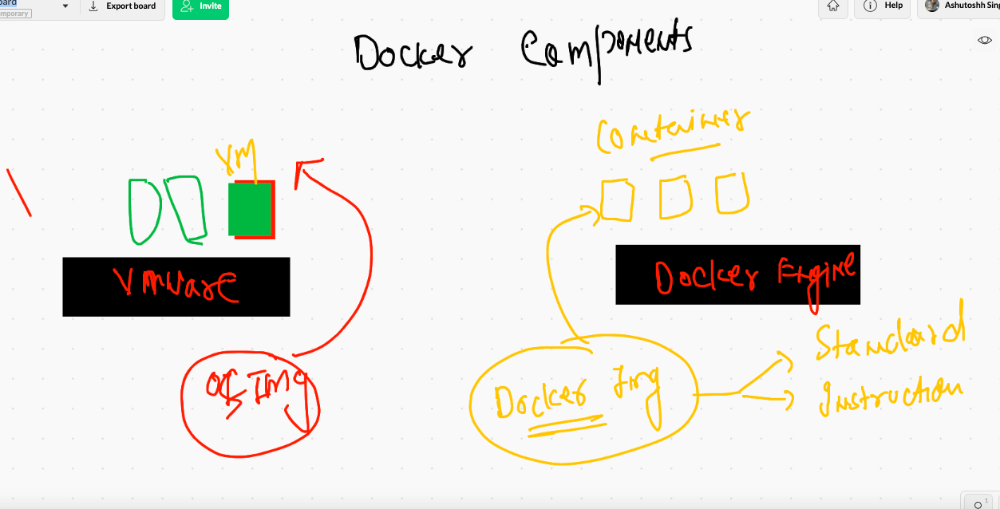

# docker and k8s learning plan 


## app deployment 

### history 


### problems in bare-metal model 


## solution to bare-metal based application deploy problem -- Virtualization by Hypervisro --


## more close application look 


## small info about OS 


## Introduction to containers 

## vm vs containers 


## Hypervisor vs Container runtime engine [CRE]


# Getting started with Docker 


## docker-ce installation 

### Docker desktop links 

[windows10](https://docs.docker.com/docker-for-windows/install/)

--===

[mac_intel](https://hub.docker.com/editions/community/docker-ce-desktop-mac)


## Manually installing docker-ce on a linux mv 

```
[root@ip-172-31-70-148 ~]# yum  install  docker  -y
Failed to set locale, defaulting to C
Loaded plugins: extras_suggestions, langpacks, priorities, update-motd
Resolving Dependencies
--> Running transaction check
---> Package docker.x86_64 0:20.10.4-1.amzn2 will be installed
--> Processing Dependency: runc >= 1.0.0 for package: docker-20.10.4-1.amzn2.x86_64
--> Processing Dependency: libcgroup >= 0.40.rc1-5.15 for package: docker-20.10.4-1.amzn2.x86_64
--> Processing Dependency: containerd >= 1.3.2 for package: docker-20.10.4-1.amzn2.x86_64
--> Processing Dependency: pigz for package: docker-20.10.4-1.amzn2.x86_64
--> Running transaction check
---> Package containerd.x86_64 0:1.4.4-1.amzn2 will be installed
---> Package libcgroup.x86_64 0:0.41-21.amzn2 will be installed
---> Package pigz.x86_64 0:2.3.4-1.amzn2.0.1 will be installed
---> Package runc.x86_64 0:1.0.0-0.3.20210225.git12644e6.amzn2 will be installed
--> Finished Dependency Resolution

Dependencies Resolved

============================================================================================================================
 Package               Arch              Version                                         Repository                    Size
============================================================================================================================
Installing:
 docker                x86_64            20.10.4-1.amzn2                                 amzn2extra-docker             32 M
Installing for dependencies:
 containerd            x86_64            1.4.4-1.amzn2                                   amzn2extra-docker             24 M
 libcgroup             x86_64            0.41-21.amzn2                                   amzn2-core                    66 k
 pigz                  x86_64            2.3.4-1.amzn2.0.1                               amzn2-core                    81 k
 runc                
 
 ```
 
 ##  configure docker engine to accept remote connection 
 
 ```
 [root@ip-172-31-70-148 ~]# history 
    1  yum  install  docker  -y
    2  history 
[root@ip-172-31-70-148 ~]# cd  /etc/sysconfig/
[root@ip-172-31-70-148 sysconfig]# ls
acpid       clock     docker          init        modules          nfs            rpc-rquotad  run-parts  sysstat.ioconf
atd         console   docker-storage  irqbalance  netconsole       raid-check     rpcbind      selinux
authconfig  cpupower  grub            keyboard    network          rdisc          rsyncd       sshd
chronyd     crond     i18n            man-db      network-scripts  readonly-root  rsyslog      sysstat
[root@ip-172-31-70-148 sysconfig]# vim  docker
[root@ip-172-31-70-148 sysconfig]# systemctl start docker 
[root@ip-172-31-70-148 sysconfig]# systemctl status  docker 
● docker.service - Docker Application Container Engine
   Loaded: loaded (/usr/lib/systemd/system/docker.service; disabled; vendor preset: disabled)
   Active: active (running) since Mon 2021-05-24 06:34:41 UTC; 10s ago
     Docs: https://docs.docker.com
  Process: 2978 ExecStartPre=/usr/libexec/docker/docker-setup-runtimes.sh (code=exited, status=0/SUCCESS)
  Process: 2966 ExecStartPre=/bin/mkdir -p /run/docker (code=exited, status=0/SUCCESS)
 Main PID: 2987 (dockerd)
    Tasks: 8
   Memory: 39.8M
   CGroup: /system.slice/docker.service
           └─2987 /usr/bin/dockerd -H fd:// --containerd=/run/containerd/containerd.sock --default-ulimit nofile=1024:409...

May 24 06:34:40 ip-172-31-70-148.ec2.internal dockerd[2987]: time="2021-05-24T06:34:40.864743402Z" level=info msg="cc...grpc
May 24 06:34:40 ip-172-31-70-148.ec2.internal dockerd[2987]: time="2021-05-24T06:34:40.864766924Z" level=info msg="Cl...grpc
May 24 06:34:40 ip-172-31-70-148.ec2.internal dockerd[2987]: time="2021-05-24T06:34:40.927164178Z" level=info msg="Lo...rt."
May 24 06:34:41 ip-172-31-70-148.ec2.internal dockerd[2987]: time="2021-05-24T06:34:41.466597200Z" level=info msg="De...ess"
May 24 06:34:41 ip-172-31-70-148.ec2.internal dockerd[2987]: time="2021-05-24T06:34:41.695410634Z" level=info msg="Lo...ne."
May 24 06:34:41 ip-172-31-70-148.ec2.internal dockerd[2987]: time="2021-05-24T06:34:41.731345324Z" level=info msg="Do...10.4
May 24 06:34:41 ip-172-31-70-148.ec2.internal dockerd[2987]: time="2021-05-24T06:34:41.731466310Z" level=info msg="Da...ion"
May 24 06:34:41 ip-172-31-70-148.ec2.internal systemd[1]: Started Docker Application Container Engine.
May 24 06:34:41 ip-172-31-70-148.ec2.internal dockerd[2987]: time="2021-05-24T06:34:41.766588302Z" level=info msg="AP...ock"
May 24 06:34:41 ip-172-31-70-148.ec2.internal dockerd[2987]: time="2021-05-24T06:34:41.769633942Z" level=info msg="AP...375"
Hint: Some lines were ellipsized, use -l to show in full.
[root@ip-172-31-70-148 sysconfig]# systemctl enable  docker 
Created symlink from /etc/systemd/system/multi-user.target.wants/docker.service to /usr/lib/systemd/system/docker.service.
[root@ip-172-31-70-148 sysconfig]# 

```

### configuration details of docker engine machine 

```
[root@ip-172-31-70-148 sysconfig]# cd /etc/sysconfig/
[root@ip-172-31-70-148 sysconfig]# ls
acpid       clock     docker          init        modules          nfs            rpc-rquotad  run-parts  sysstat.ioconf
atd         console   docker-storage  irqbalance  netconsole       raid-check     rpcbind      selinux
authconfig  cpupower  grub            keyboard    network          rdisc          rsyncd       sshd
chronyd     crond     i18n            man-db      network-scripts  readonly-root  rsyslog      sysstat
[root@ip-172-31-70-148 sysconfig]# cat  docker
# The max number of open files for the daemon itself, and all
# running containers.  The default value of 1048576 mirrors the value
# used by the systemd service unit.
DAEMON_MAXFILES=1048576

# Additional startup options for the Docker daemon, for example:
# OPTIONS="--ip-forward=true --iptables=true"
# By default we limit the number of open files per container
OPTIONS="--default-ulimit nofile=1024:4096 -H tcp://0.0.0.0:2375"

# How many seconds the sysvinit script waits for the pidfile to appear
# when starting the daemon.
DAEMON_PIDFILE_TIMEOUT=10

```

### Docker client and docker engine connection 


### Docker client and engine details 


## understanding and creating docker context 

```
❯                                                                                                                        ─╯
❯ docker  context   ls
NAME                TYPE                DESCRIPTION                               DOCKER ENDPOINT               KUBERNETES ENDPOINT                    ORCHESTRATOR
default *           moby                Current DOCKER_HOST based configuration   unix:///var/run/docker.sock   https://52.20.84.60:6443 (ashuspace)   swarm
❯ 
❯ docker   context  create  awsde  --docker  "host=tcp://52.21.252.231:2375"
awsde
Successfully created context "awsde"
❯ docker  context   ls
NAME                TYPE                DESCRIPTION                               DOCKER ENDPOINT               KUBERNETES ENDPOINT                    ORCHESTRATOR
awsde               moby                                                          tcp://52.21.252.231:2375                                             
default *           moby                Current DOCKER_HOST based configuration   unix:///var/run/docker.sock   https://52.20.84.60:6443 (ashuspace)   swarm
❯ 
❯ docker  context   use  awsde
awsde
❯ docker  context   ls
NAME                TYPE                DESCRIPTION                               DOCKER ENDPOINT               KUBERNETES ENDPOINT                    ORCHESTRATOR
awsde *             moby                                                          tcp://52.21.252.231:2375                                             
default             moby                Current DOCKER_HOST based configuration   unix:///var/run/docker.sock   https://52.20.84.60:6443 (ashuspace)   swarm


```


### creating vm vs container 



### container creation process


###  registry understanding 


# Getting started with container creation process

## checking images in docker engine host 

```
❯ docker   images
REPOSITORY   TAG       IMAGE ID   CREATED   SIZE

░▒▓ ~ ·········

```

## searching image from docker client machine 

```
❯ docker  search  java
NAME                                     DESCRIPTION                                     STARS     OFFICIAL   AUTOMATED
node                                     Node.js is a JavaScript-based platform for s…   10081     [OK]       
tomcat                                   Apache Tomcat is an open source implementati…   3035      [OK]       
openjdk                                  OpenJDK is an open-source implementation of …   2747      [OK]       
java                                     Java is a concurrent, class-based, and objec…   1976      [OK]       
ghost                                    Ghost is a free and open source blogging pla…   1364      [OK]       
couchdb                                  CouchDB is a database that uses JSON for doc…   406       [OK]       
jetty                                    Jetty provides a Web server and javax.servle…   362       [OK]       
groovy                                   Apache Groovy is a multi-faceted language fo…   107       [OK]       
lwieske/java-8                           Oracle Java 8 Container - Full + Slim - Base…   49                   [OK]
nimmis/java-centos                       This is docker images of CentOS 7 with diffe…   42                   [OK]
fabric8/java-jboss-openjdk

```

## Downloading image to Docker engine host 

```
❯ docker  pull   openjdk
Using default tag: latest
latest: Pulling from library/openjdk
9509c6b41a37: Pull complete 
1a0005db7778: Pull complete 
aa65e6d4b4e5: Pull complete 
Digest: sha256:73c458a98e3546a8e972ada48d62ad6b4b000f2925c14c25e30a1a37fcdc7879
Status: Downloaded newer image for openjdk:latest
docker.io/library/openjdk:latest
❯ docker  images
REPOSITORY   TAG       IMAGE ID       CREATED       SIZE
openjdk      latest    9991202d6ad6   4 weeks ago   467MB
❯ docker  pull   tomcat

```

### docker pull history 

```
10031  docker  pull   openjdk 
10032  docker  images
10033  docker  pull   tomcat 
10034  history
10035  docker  images
10036  docker pull oraclelinux
10037  docker pull oraclelinux:8.3
10038  docker images
10039  docker pull  alpine 
10040  docker pull  busybox 
❯ docker  images
REPOSITORY    TAG       IMAGE ID       CREATED       SIZE
busybox       latest    d3cd072556c2   6 days ago    1.24MB
tomcat        latest    c43a65faae57   10 days ago   667MB
openjdk       latest    9991202d6ad6   4 weeks ago   467MB
oraclelinux   8.3       816d99f0bbe8   5 weeks ago   224MB
alpine        latest    6dbb9cc54074   5 weeks ago   5.61MB


```

## docker in one glimpse


## creating first container 


### alpine container creating 


###

```
  docker  run  --name ashuc1   -d  alpine:latest   ping  fb.com 
```

### checking list of running containers 

```
❯ docker  ps
CONTAINER ID   IMAGE            COMMAND             CREATED              STATUS              PORTS     NAMES
16278d7804de   alpine:latest    "ping fb.com"       24 seconds ago       Up 22 seconds                 shobhit_c1
6a055e4d9823   alpine:latest    "ping fb.com"       About a minute ago   Up About a minute             asim1
54a45eb73fc6   busybox:latest   "ping google.com"   About a minute ago   Up About a minute             rahul
33729456c548   alpine:latest    "ping fb.com"       2 minutes ago        Up 2 minutes                  ashuc1


```

### checking all containers list running / exited 

```
❯ docker  ps -a
CONTAINER ID   IMAGE             COMMAND                 CREATED          STATUS                       PORTS      NAMES
f57d1a8ac17d   alpine:latest     "ping fb.com"           2 minutes ago    Up 2 minutes                            sreenathc2
a8eaad8fe46e   alpine:latest     "ping fb.com"           6 minutes ago    Exited (137) 5 minutes ago              ajithc3
44938093f018   alpine:latest     "ping google.com"       7 minutes ago    Exited (137) 5 minutes ago              ganesh2
7dc81a9708f4   alpine:latest     "ping fb.com"           8 minutes ago    Exited (137) 5 minutes ago              sreenathc1
c92fa7ca39a4   alpine:latest     "google.com"            8 minutes ago    Created                                 ganesh1
e4b5b6c87f20   tomcat:latest     "ping www.google.com"   8 minutes ago    Exited (137) 5 minutes ago   8080/tcp   testsudhi
bcedac141698   alpine:latest     "ping google.com"       9 minutes ago    Exited (137) 5 minutes ago              priya
27f77afc618a   oraclelinux:8.3   "/bin/bash"             11 minutes ago   Exited (0) 7 minutes ago                testsudhi1
16278d7804de   alpine:latest     "ping fb.com"           11 minutes ago   Exited (137) 5 minutes ago              shobhit_c1
6bc768058ee9   alpine:latest     "ping .com"             11 minutes ago   Exited (1) 11 minutes ago               ajithc1
6a055e4d9823   alpine:latest     "ping fb.com"          

```

### starting a exited / stopped container 

```
❯ docker  start  ashuc1
ashuc1
❯ docker  ps
CONTAINER ID   IMAGE           COMMAND             CREATED          STATUS          PORTS     NAMES
eb22edfca7ca   alpine:latest   "ping google.com"   37 seconds ago   Up 35 seconds             ganesh3
a9ab671360cf   alpine:latest   "ping fb.com"       2 minutes ago    Up 2 minutes              govind
5cfe172ea627   alpine:latest   "ping google.com"   4 minutes ago    Up 4 minutes              sivacnt
f57d1a8ac17d   alpine:latest   "ping fb.com"       9 minutes ago    Up 9 minutes              sreenathc2
33729456c548   alpine:latest   "ping fb.com"       20 minutes ago   Up 3 seconds              ashuc1

```

### accessing shell of a running container 


### exec demo 

```
❯ docker  exec   -it  ashuc1    sh
/ # 
/ # 
/ # ls  /
bin    dev    etc    home   lib    media  mnt    opt    proc   root   run    sbin   srv    sys    tmp    usr    var
/ # ifconfig 
eth0      Link encap:Ethernet  HWaddr 02:42:AC:11:00:06  
          inet addr:172.17.0.6  Bcast:172.17.255.255  Mask:255.255.0.0
          UP BROADCAST RUNNING MULTICAST  MTU:1500  Metric:1
          RX packets:382 errors:0 dropped:0 overruns:0 frame:0
          TX packets:450 errors:0 dropped:0 overruns:0 carrier:0
          collisions:0 txqueuelen:0 
          RX bytes:35328 (34.5 KiB)  TX bytes:42396 (41.4 KiB)

lo        Link encap:Local Loopback  
          inet addr:127.0.0.1  Mask:255.0.0.0
          UP LOOPBACK RUNNING  MTU:65536  Metric:1
          RX packets:0 errors:0 dropped:0 overruns:0 frame:0
          TX packets:0 errors:0 dropped:0 overruns:0 carrier:0
          collisions:0 txqueuelen:1000 
          RX bytes:0 (0.0 B)  TX bytes:0 (0.0 B)

/ # uname
Linux
/ # uname -r
4.14.231-173.361.amzn2.x86_64
/ # exit

```

### stoping and removing container 

```
❯ docker  ps
CONTAINER ID   IMAGE     COMMAND         CREATED         STATUS         PORTS     NAMES
ff61b4b58e81   alpine    "ping fb.com"   3 minutes ago   Up 5 seconds             ashuc11
❯ docker  stop  ashuc11
ashuc11
❯ docker  rm   ashuc11
ashuc11

```


